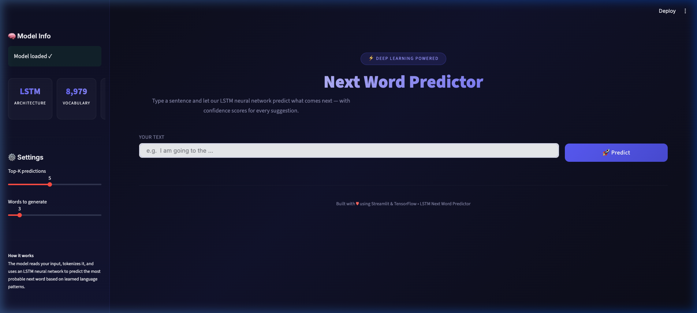
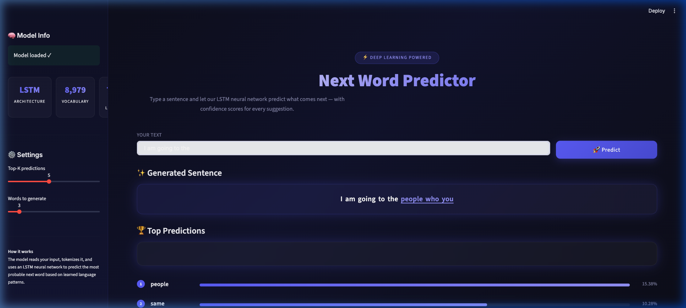
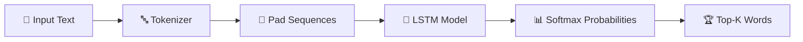

<p align="center">
  
  
  
  
  
  <a href="https://ai-next-word-prediction-system.onrender.com/">
    
  </a>
</p>

<h1 align="center">🧠 Next Word Predictor</h1>

<p align="center">
  <strong>An LSTM-powered deep learning application that predicts the next word in a sentence with confidence scores.</strong>
</p>

<p align="center">
  <a href="https://ai-next-word-prediction-system.onrender.com/">🌐 Live Demo</a> •
  <a href="#features">Features</a> •
  <a href="#demo">Demo</a> •
  <a href="#tech-stack">Tech Stack</a> •
  <a href="#installation">Installation</a> •
  <a href="#deployment">Deployment</a> •
  <a href="#how-it-works">How It Works</a> •
  <a href="#license">License</a>
</p>

---

## ✨ Features

| Feature | Description |
|---------|-------------|
| 🎯 **Next Word Prediction** | Predicts the most probable next word using a trained LSTM model |
| 📊 **Top-K Predictions** | Displays multiple word suggestions ranked by probability |
| 📈 **Confidence Scores** | Visual probability bars for each predicted word |
| 🔗 **Sentence Generation** | Auto-generates complete sentences word by word |
| ⚙️ **Adjustable Settings** | Customize Top-K count and number of words to generate |
| 🌙 **Dark Theme UI** | Professional glassmorphism design with gradient accents |
| ⚡ **Cached Model Loading** | Fast subsequent loads with Streamlit caching |

---

## 🎬 Demo

### Landing Page
<p align="center">
  
</p>

### Prediction Results
<p align="center">
  
</p>

> 💡 **Try it live:** Type any sentence fragment and click **🚀 Predict** to see the model's suggestions!

---

## 🛠️ Tech Stack

- **Frontend:** [Streamlit](https://streamlit.io/) — Interactive web UI
- **Deep Learning:** [TensorFlow](https://www.tensorflow.org/) / [Keras](https://keras.io/) — LSTM Model
- **Language:** Python 3.11
- **Model Architecture:** LSTM (Long Short-Term Memory)
- **Vocabulary Size:** 8,979 words
- **Max Sequence Length:** 745 tokens

---

## 📦 Installation

### Prerequisites

- Python 3.11 (recommended)
- pip or conda

### Setup

1. **Clone the repository**
   ```bash
   git clone https://github.com/<your-username>/next-word-predictor.git
   cd next-word-predictor
   ```

2. **Create a virtual environment** (recommended)
   ```bash
   # Using conda
   conda create -n nextword python=3.11 -y
   conda activate nextword

   # Or using venv
   python -m venv venv
   source venv/bin/activate  # macOS/Linux
   venv\Scripts\activate     # Windows
   ```

3. **Install dependencies**
   ```bash
   pip install -r requirements.txt
   ```

4. **Run the application**
   ```bash
   streamlit run app.py
   ```

5. Open your browser at `http://localhost:8501`

---

## 🚀 Deployment

### Deploy on Render

1. Push your code to GitHub
2. Go to [Render](https://render.com/) → **New Web Service**
3. Connect your GitHub repository
4. Configure:

   | Setting | Value |
   |---------|-------|
   | **Runtime** | Python 3 |
   | **Build Command** | `pip install -r requirements.txt` |
   | **Start Command** | `streamlit run app.py --server.port $PORT --server.headless true` |

5. Click **Deploy** 🎉

### Deploy on Streamlit Cloud

1. Push your code to GitHub
2. Go to [share.streamlit.io](https://share.streamlit.io/)
3. Select your repository and `app.py`
4. Click **Deploy**

---

## 🧪 How It Works



1. **Tokenization** — Input text is converted to numerical sequences using the trained tokenizer
2. **Padding** — Sequences are padded to match the model's expected input length (745 tokens)
3. **Prediction** — The LSTM model outputs probability scores for all words in the vocabulary
4. **Ranking** — Top-K words with highest probabilities are displayed with confidence scores

---

## 📁 Project Structure

```
next-word-predictor/
├── app.py                 # Streamlit application
├── LSTM Model.h5          # Trained LSTM model weights
├── tokenizer.pkl          # Fitted tokenizer
├── Model max len.pkl      # Maximum sequence length
├── requirements.txt       # Python dependencies
├── screenshots/           # App screenshots
│   ├── landing_page.png
│   └── prediction_results.png
└── README.md              # This file
```

---

## 🤝 Contributing

Contributions are welcome! Feel free to:

1. Fork the repository
2. Create a feature branch (`git checkout -b feature/amazing-feature`)
3. Commit your changes (`git commit -m 'Add amazing feature'`)
4. Push to the branch (`git push origin feature/amazing-feature`)
5. Open a Pull Request

---

## 📄 License

This project is licensed under the MIT License — see the [LICENSE](LICENSE) file for details.

---

<p align="center">
  Built with ❤️ using Streamlit & TensorFlow
</p>
